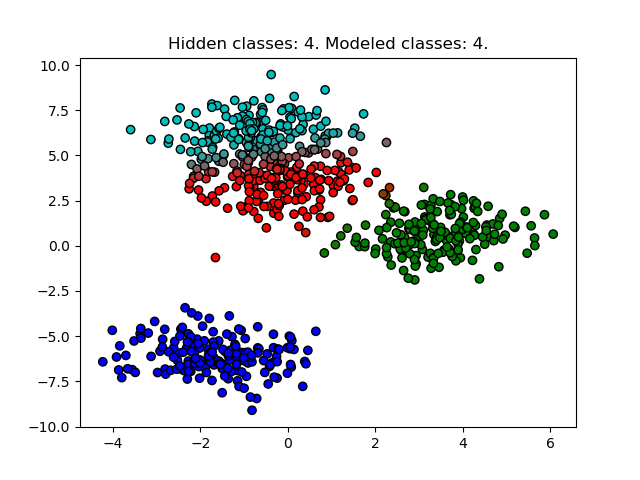
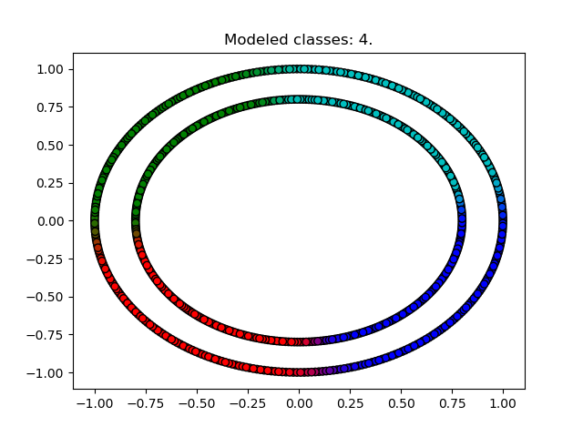

# Gaussian Mixture Models: probabilistically clustering unlabeled data

Here is a simple implementation of Gaussian Mixture Models to cluster unlabeled data. [Sklearn already does this](http://scikit-learn.org/stable/modules/mixture.html)- this is simply for my own interest (what happens if we use softmax normalization as opposed to standard normalization? what sort of effect do various stopping criteria have on the result? etc.) and certainly not for actual use. 

### Expectation-Maximization (EM) optimization

If the data were labeled, this model essentially reduces to a Gaussian generative classifier. But since the data are unlabeled, we can't work with the true classes of the data. To mitigate this we choose a number of classes/clusters to model the data to, `model`, and introduce a probability vector q_n for each datum x_n which contains the probability that x_n belongs to each cluster. The images below shade each point according to the resulting q_n that the optimization algorithm produces.

### Ideal case for the model: Gaussian hidden classes (blobs)

For these images, we generate [Gaussian blobs data](http://scikit-learn.org/stable/modules/generated/sklearn.datasets.make_blobs.html#sklearn.datasets.make_blobs) with `hidden` number of classes and then model it data with GMM using `model` classes. `hidden` and `model` may not be the same (see below for results).

Also note that `make_blobs` may superimpose different blobs, so you may not visually see `hidden` blobs clearly.

## Circle data

Note one could transform this data to a polar (radius, angle) basis to cluster the inner and outer rings, which essentially reduces it to a blob case like above.

## [Random classification data](http://scikit-learn.org/stable/modules/generated/sklearn.datasets.make_classification.html#sklearn.datasets.make_classification)

Note the effect of using a probabilistic model as opposed to non-probablistic like K-means or HAC: the probabilistic views clusters in terms of density/variance, and since the green cluster has much higher variance/spread than the red cluster, the probability component extends further than the red, eventually clustering the bottom left point green. A non-prob model would likely not exhibit this behavior: K-means minimizes total distance from means and the point is closer to the red mean.

However GMM very effectively captures blobs of different shapes as opposed to K-means which (for the Euclidean norm) creates a linear boundary in feature space. (should add image to demonstrate what I mean)

