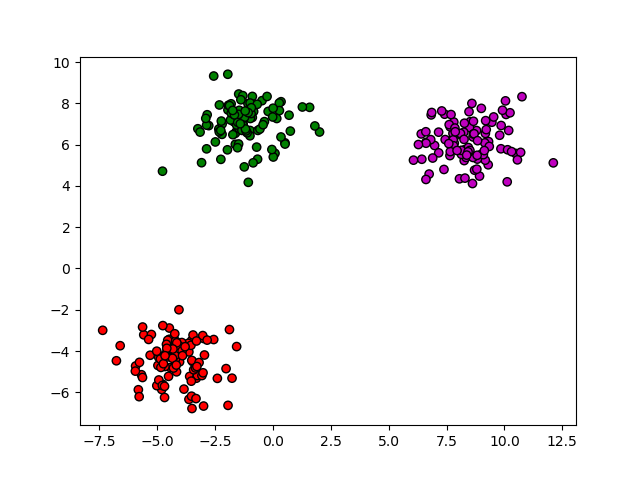
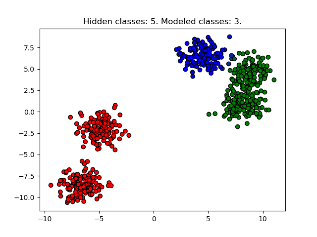
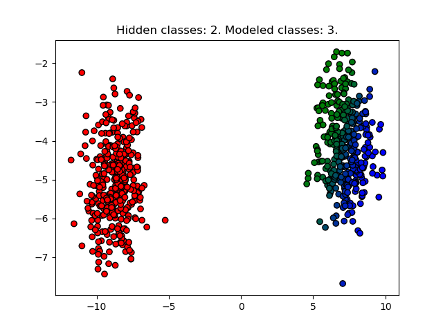
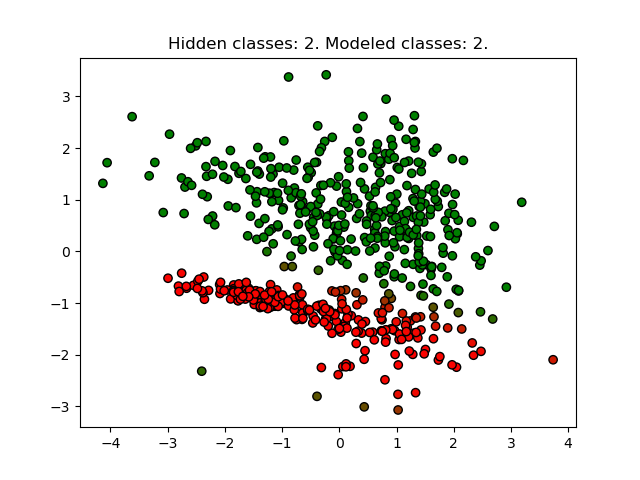
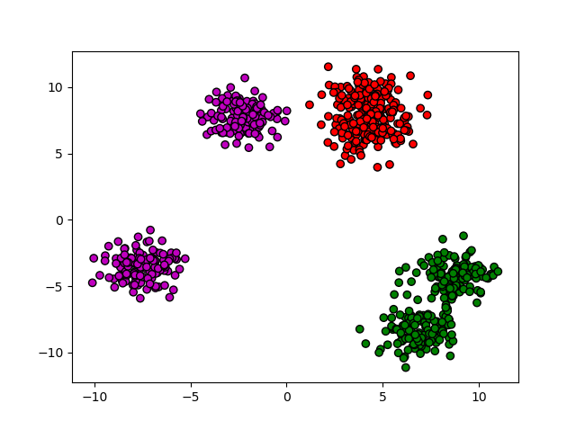

# Gaussian Mixture Models: clustering unlabeled data

Here is a simple implementation of Gaussian Mixture Models to cluster unlabeled data. [Sklearn already does this,](http://scikit-learn.org/stable/modules/mixture.html)- this is simply for my own interest and certainly not for actual use.

## Expecation-Maximization (EM) optimization

For these images, we generate data from actual/hidden Gaussian components and then model the resulting data with GMM.

3 hidden clusters, modeling 3 clusters:

4 hidden clusters, modeling 2 clusters:
 

 

5 hidden clusters, modeling 5 clusters:
 

6 hidden clusters, modeling 3 clusters:

